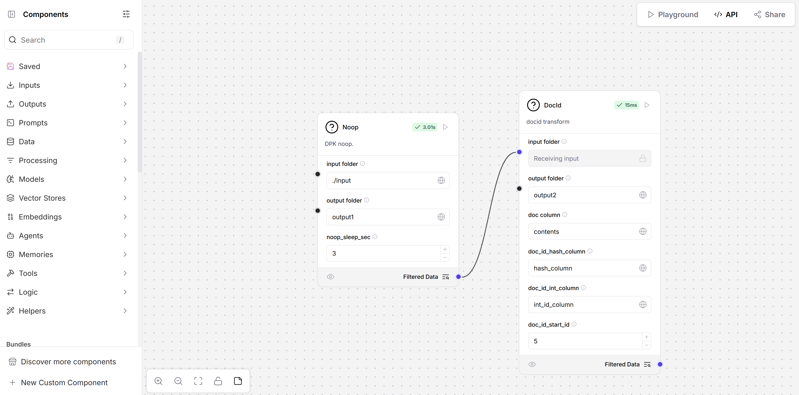

## DPK components

### Installation
- Run the Langflow [quick start](https://github.com/langflow-ai/langflow/blob/main/docs/docs/Get-Started/get-started-installation.md).
- Install `dpk` python libraries.
    - `pip install data-prep-toolkit==0.2.3 data-prep-toolkit-transforms[all,ray]==1.0.0a2`
- Create a blank flow.

### First option - import flow
- Near the project name click the arrow then click the `Import`. Choose the `dpk-flow.json`.
- In the `input folder` field put the path of an input folder. For example the path of `input` folder.
- In the `output folder` fields put the path of output folders.
- Run the `DocId` component from the UI.

### Second option - import components
- Near the project name click the arrow then click the `Import`. Choose the `Noop.json` and `DocId.json`.
- You can `save` the component in order to appear on the left side (under the saved tab) and users just can drag and drop the components and connect them in the UI. (More details can be fount in [langflow docs](https://docs.langflow.org/concepts-components))
- Connect the `Noop` and `DocId` components by dragging the `dot` of the output in the `Noop` component to the `dot` of the input field in the `DocId` component.
- Fill the input parameters of the components with the needed values.
- Run the `DocId` component from the UI.

### Create new components
- `Langflow` enables to add [custom components using python code](https://docs.langflow.org/components-custom-components).
- For each dpk transform, a new component can be created (it can be with local python or ray).
- Examples of the component implementations can be found in [`noop_component.py`](./noop_component.py) and [`docid_component.py`](./docid_component.py).
