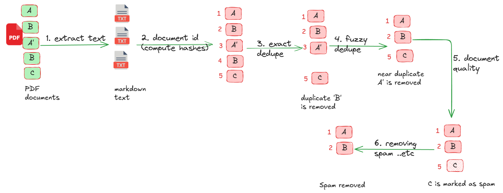

# PDF Processing with Data Prep Kit

Show cases Data Prep Kit capabilities of processing PDFs.

We will demonstrate the following:

- Extracting text from PDF files
- removing duplicates (exact and fuzzy matches)
- accessing document quality and removing documents containing spam words, placeholder content like 'lorem ipsum' ..etc.

**Workflow**



## Setting up Python Environment

The code can be run on either 

1.  Google colab: very easy to run; no local setup needed.
2.  On your local Python environment.  You can  find instructions [here](../../doc/quick-start/quick-start.md).  Here is a quick guide.

You can use either [Anaconda](https://www.anaconda.com/download/) or [Miniforge](https://github.com/conda-forge/miniforge) to create your Python environment.

```bash
conda create -n data-prep-kit -y python=3.11
conda activate data-prep-kit

# install the following in 'data-prep-kit' environment
cd examples/pdf-processing-1
pip install -r requirements.txt

# start jupyter and run the notebooks with this jupyter
jupyter lab
```

## Data Files

PDF files are located in [examples/data-files/pdf-processing-1](../examples/data-files/pdf-processing-1/)

## Running the code

[python version](pdf_processing_1_python.ipynb)  &nbsp;    [](https://colab.research.google.com/github/data-prep-kit/data-prep-kit/blob/dev/examples/pdf-processing-1/pdf_processing_1_python.ipynb)

[ray version](pdf_processing_1_ray.ipynb)  &nbsp;   [](https://colab.research.google.com/github/data-prep-kit/data-prep-kit/blob/dev/examples/pdf-processing-1/pdf_processing_1_ray.ipynb)

## Troubleshooting

If you encounter any errors loading libraries, try creating a custom kernel and using it to run the notebooks.

```bash
python -m ipykernel install --user --name=data-prep-kit --display-name "dataprepkit"
# and select this kernel within jupyter notebook
```
